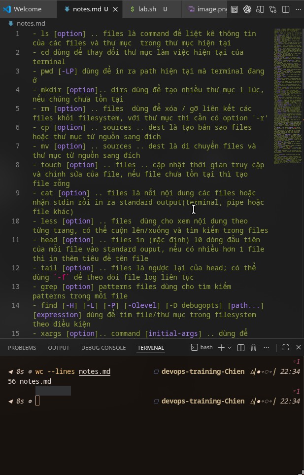
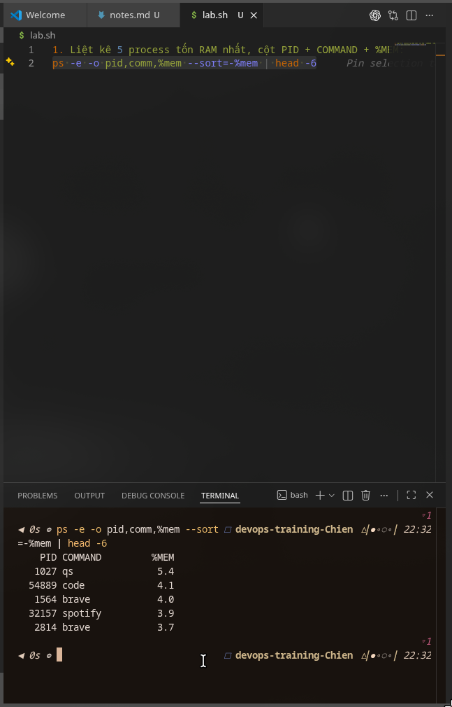
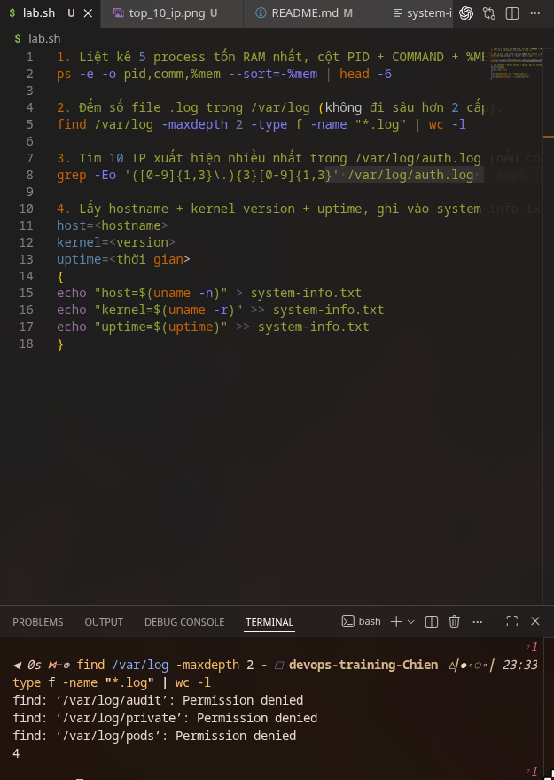
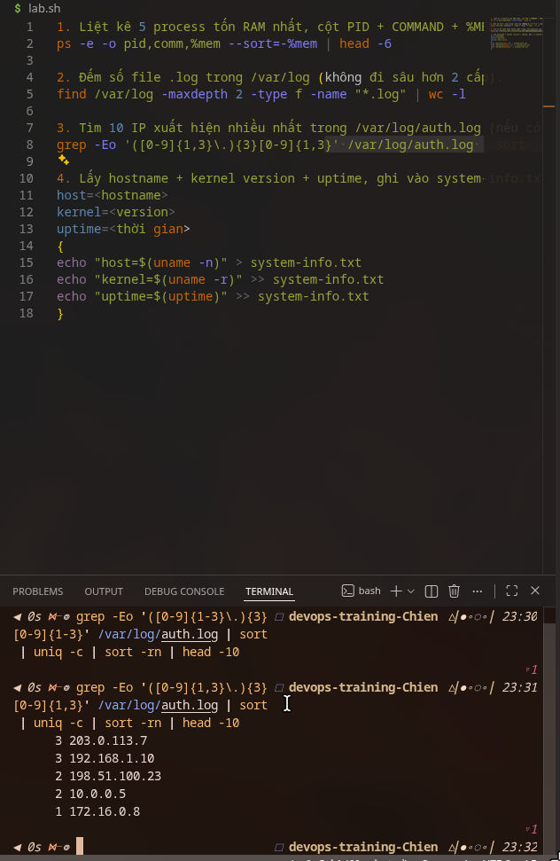
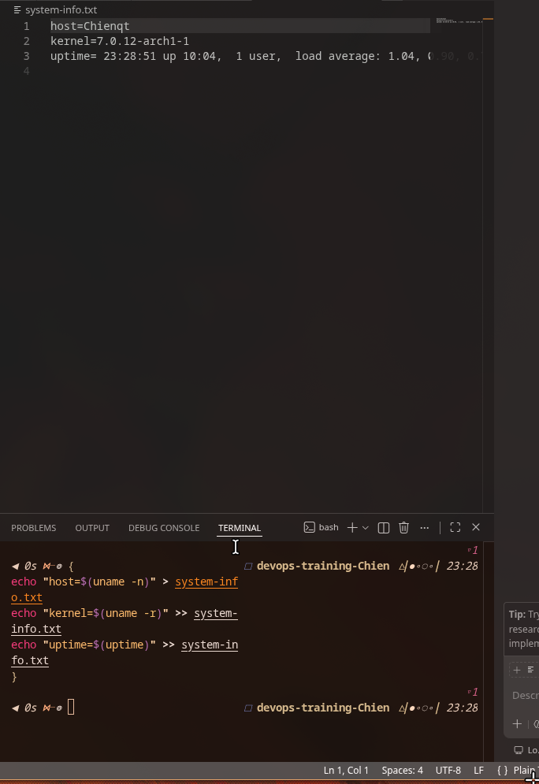
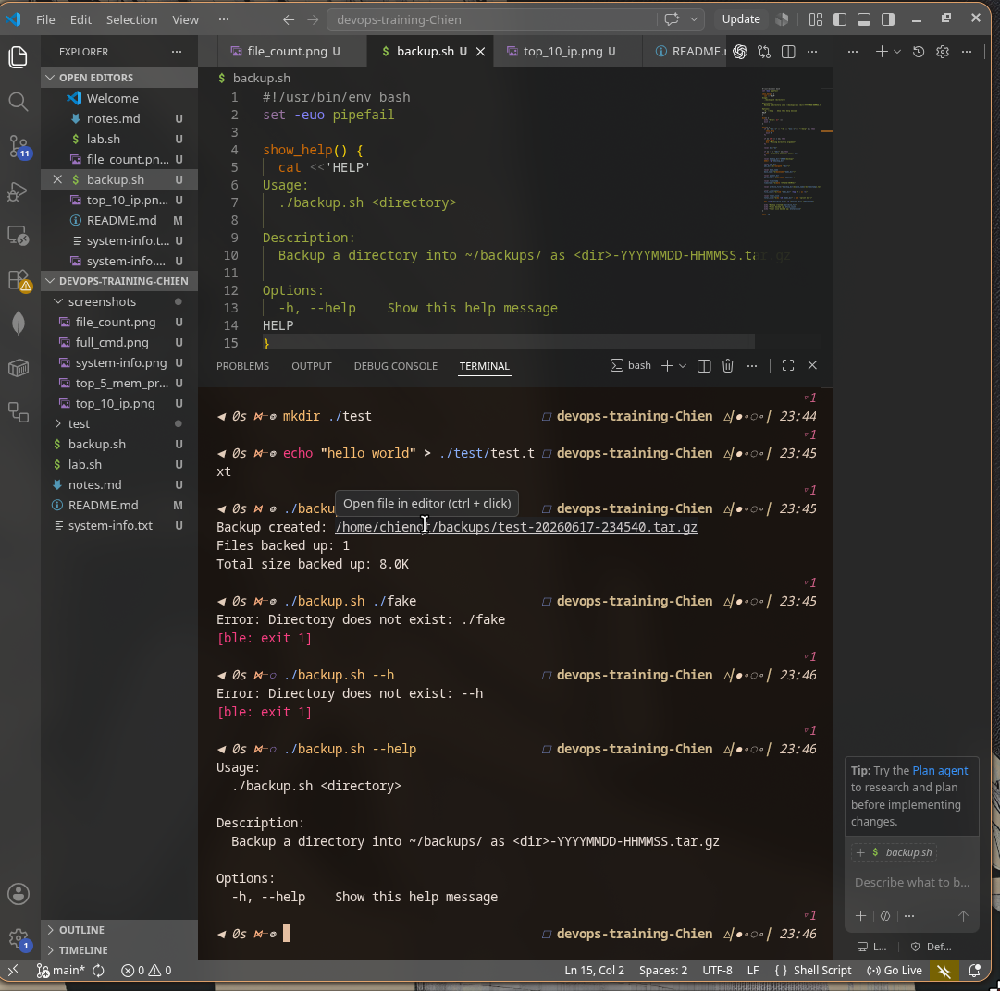

# Task: `Linux fundamentals`

- **Intern**: `Bùi Anh Chiến`
- **Phase / Week / Day**: `Phase 1 / Week 1 / Day 1`
- **Branch**: `phase-1/week-1/day-1-linux`
- **Submitted at**: `2026-06-17 23:32` (timezone +07)
- **Time spent**: `5 giờ`

## 1. Mục tiêu

Thực hành các command Linux cơ bản để làm quen với thao tác file, thư mục, process, log và thông tin hệ thống.
Bài làm gồm ghi chú hơn 20 command thường dùng, chạy các lệnh lab để xử lý dữ liệu hệ thống, và viết script backup thư mục thành file `.tar.gz`.

## 2. Cách chạy

```bash
# Từ thư mục gốc của repo
cd day-1-linux

# Part A: xem ghi chú command
cat notes.md

# Part B: xem các command lab đã làm
cat lab.sh

# Liệt kê 5 process tốn RAM nhất
ps -e -o pid,comm,%mem --sort=-%mem | head -6

# Đếm số file .log trong /var/log, không đi sâu quá 2 cấp
find /var/log -maxdepth 2 -type f -name "*.log" | wc -l

# Tìm 10 IP xuất hiện nhiều nhất trong /var/log/auth.log nếu file tồn tại
if [ -f /var/log/auth.log ]; then
  grep -Eo '([0-9]{1,3}\.){3}[0-9]{1,3}' /var/log/auth.log | sort | uniq -c | sort -nr | head -10
else
  echo "/var/log/auth.log not found"
fi

# Ghi hostname, kernel version và uptime vào system-info.txt
{
  echo "host=$(uname -n)"
  echo "kernel=$(uname -r)"
  echo "uptime=$(uptime)"
} > system-info.txt

cat system-info.txt

# Part C: chạy script backup
chmod +x backup.sh
./backup.sh .

# Kiểm tra file backup đã tạo
ls -lh ~/backups
```

## 3. Kết quả

- Screenshot kết quả được lưu trong `./screenshots/`.
- Link demo: Không có.

### Part A - Danh sách command trong `notes.md`



### Part B - 5 process tốn RAM nhất



### Part B - Đếm số file log



### Part B - 10 IP xuất hiện nhiều nhất



### Part B - Ghi thông tin hệ thống



### Part C - Chạy `backup.sh`



## 4. Khó khăn & cách giải quyết

- Một số máy Linux/WSL có thể không có file `/var/log/auth.log` -> kiểm tra file tồn tại trước khi chạy command grep IP.
- Khi backup thư mục, nếu dùng đường dẫn tương đối có thể khó đặt tên file archive chính xác -> dùng `realpath`, `basename` và `dirname` để lấy đường dẫn tuyệt đối, tên thư mục và thư mục cha.

## 5. Reference

- Linux manual page for `ps`: https://man7.org/linux/man-pages/man1/ps.1.html
- Linux manual page for `find`: https://man7.org/linux/man-pages/man1/find.1.html
- GNU tar manual: https://www.gnu.org/software/tar/manual/tar.html
- Conventional Commits specification: https://www.conventionalcommits.org/en/v1.0.0/

## 6. Self-check

- [x] Code chạy được trên máy sạch.
- [x] README có hướng dẫn run lại.
- [x] Không hard-code secret.
- [x] Commit message theo Conventional Commits.
- [x] Đã review lại code 1 lượt.
