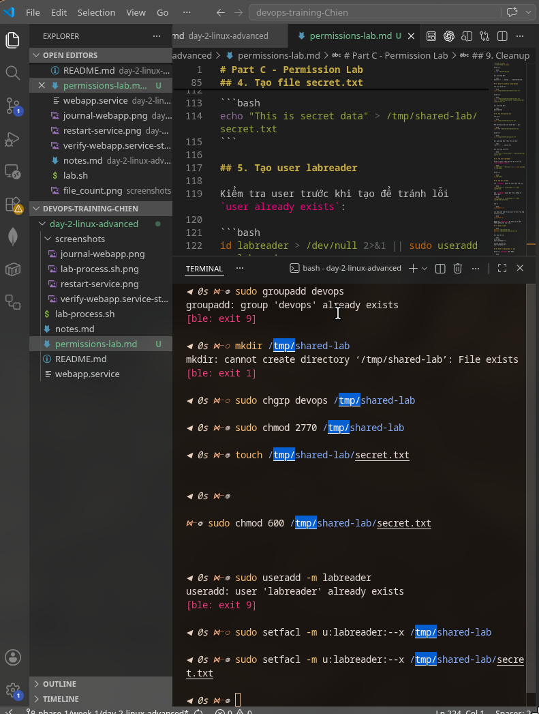

# DevOps Training - Bùi Anh Chiến
# Task Submission Template


## Task: `<Linux Advanced: Process, systemd, Permission, Networking>`

- **Intern**: Bùi Anh Chiến
- **Phase / Week / Day**: Phase 1 / Week 1 / Day 2
- **Branch**: phase-1/week-1/day-2-linux-advanced
- **Submitted at**: 2026-06-18 HH:MM (timezone +07)
- **Time spent**: 5

## 1. Mục tiêu
Hiểu process tree, signal, foreground/background, nohup/disown.
Viết được 1 systemd unit để daemonize service.
Quản lý permission nâng cao: setuid/setgid/sticky bit, ACL.
Networking cơ bản: interface, route, dns, port, socket.

## 2. Cách chạy

### Chuẩn bị

Yêu cầu máy Linux đang chạy systemd và user có quyền `sudo`.

```bash
# Clone trực tiếp branch Day 2 từ GitHub
git clone --branch phase-1/week-1/day-2-linux-advanced \
  --single-branch \
  https://github.com/chiendz11/devops-training-Chien.git

# Di chuyển vào đúng thư mục bài
cd devops-training-Chien/day-2-linux-advanced

# Kiểm tra branch hiện tại
git branch --show-current

# Kết quả mong đợi là "systemd"
ps -p 1 -o comm=
```

Kết quả branch mong đợi:

```text
phase-1/week-1/day-2-linux-advanced
```

### Part A - Process & signal

```bash
chmod +x lab-process.sh
./lab-process.sh
```

### Part B - systemd web service

#### 1. Cài dependency

```bash
sudo apt-get update
sudo apt-get install -y python3 curl
```

#### 2. Chuẩn bị Python web app

Tạo working directory và một trang HTML đơn giản:

```bash
sudo mkdir -p /opt/webapp
echo '<h1>Demo web app</h1>' | sudo tee /opt/webapp/index.html > /dev/null
sudo chown -R "$USER:$USER" /opt/webapp
```

#### 3. Cài unit file

Thay `User=` trong unit file bằng user hiện tại, sau đó tạo symlink từ repository tới thư mục systemd:

```bash
# Kiểm tra user hiện tại
whoami

# Thay User= trong unit file bằng user đang chạy bài
sed -i "s/^User=.*/User=$USER/" webapp.service

# Kiểm tra User= đã khớp với user hiện tại
unit_user="$(sed -n 's/^User=//p' webapp.service)"
if [[ "$unit_user" == "$USER" ]]; then
  echo "PASS: User=$unit_user"
else
  echo "FAIL: User=$unit_user, expected User=$USER"
  exit 1
fi

# Xóa unit/symlink cũ nếu đã cài trước đó
sudo rm -f /etc/systemd/system/webapp.service

# systemd cần symlink trỏ tới đường dẫn tuyệt đối
sudo ln -s "$(realpath webapp.service)" \
  /etc/systemd/system/webapp.service

# Kiểm tra symlink trỏ đúng unit file trong repository
find /etc/systemd/system -type l -name '*webapp*' -ls

# Reload và start service
sudo systemctl daemon-reload
sudo systemctl enable --now webapp
```

Có thể xem lại symlink và user bằng:

```bash
ls -l /etc/systemd/system/webapp.service
grep '^User=' webapp.service
```

#### 4. Verify service và port 8080

```bash
systemctl is-enabled webapp
systemctl is-active webapp
systemctl status webapp --no-pager

curl http://127.0.0.1:8080
ss -ltnp | grep ':8080'
```

Kết quả mong đợi:

- `systemctl is-enabled webapp` trả về `enabled`.
- `systemctl is-active webapp` trả về `active`.
- `curl` trả về nội dung `<h1>Demo web app</h1>`.
- Port `8080` ở trạng thái `LISTEN`.

#### 5. Kiểm tra systemd tự restart trong dưới 5 giây

Lấy PID hiện tại, kill process bằng `SIGKILL`, chờ 4 giây rồi kiểm tra PID mới:

```bash
old_pid="$(systemctl show webapp --property MainPID --value)"
echo "Old PID: $old_pid"

sudo kill -KILL "$old_pid"
sleep 4

new_pid="$(systemctl show webapp --property MainPID --value)"
echo "New PID: $new_pid"

systemctl is-active webapp
systemctl status webapp --no-pager
```


#### 6. Xem log service

Theo dõi log realtime, nhấn `Ctrl+C` để thoát:

```bash
journalctl -u webapp -f
```

#### 7. Chụp screenshot nộp bài

Chạy:

```bash
systemctl status webapp --no-pager
```

Chụp màn hình có các thông tin `Loaded`, `Active`, `Main PID` và command Python server. Lưu ảnh vào:

```text
screenshots/verify-web.service-status.png
```

Screenshot kết quả:


#### 8. Cleanup sau khi hoàn thành

Chỉ chạy phần này khi không cần giữ service:

```bash
sudo systemctl disable --now webapp
sudo rm -f /etc/systemd/system/webapp.service
sudo systemctl daemon-reload
sudo rm -rf /opt/webapp
```

### Part C - Permission lab

Steps reproduce đầy đủ được ghi trong [`permissions-lab.md`](permissions-lab.md).

#### 1. Tạo group và thư mục shared

```bash
# Tạo group nếu chưa tồn tại
getent group devops > /dev/null || sudo groupadd devops

# Tạo thư mục dùng chung
sudo mkdir -p /tmp/shared-lab
sudo chown "$USER":devops /tmp/shared-lab

# Bật setgid để file mới inherit group devops
sudo chmod 2770 /tmp/shared-lab

# Kiểm tra owner, group và setgid bit
ls -ld /tmp/shared-lab
```

Kết quả mong đợi:

```text
drwxrws--- ... <user hiện tại> devops ... /tmp/shared-lab
```

#### 2. Kiểm tra file mới inherit group devops

```bash
touch /tmp/shared-lab/inherit-test.txt
stat -c 'owner=%U group=%G' /tmp/shared-lab/inherit-test.txt
```

Kết quả mong đợi:

```text
group=devops
```

#### 3. Tạo secret.txt chỉ owner đọc và ghi

```bash
echo "This is secret data" > /tmp/shared-lab/secret.txt
chmod 600 /tmp/shared-lab/secret.txt
ls -l /tmp/shared-lab/secret.txt
```

Kết quả mong đợi trước khi cấp ACL:

```text
-rw------- ... secret.txt
```

#### 4. Tạo user và cấp ACL chỉ đọc

```bash
# Cài ACL tool nếu máy chưa có
sudo apt-get update
sudo apt-get install -y acl

# Tạo user kiểm thử nếu chưa tồn tại
id labreader > /dev/null 2>&1 || sudo useradd -m labreader

# Cho phép user đi xuyên qua thư mục
sudo setfacl -m u:labreader:--x /tmp/shared-lab

# Cho phép user chỉ đọc secret.txt
sudo setfacl -m u:labreader:r-- /tmp/shared-lab/secret.txt

# Kiểm tra ACL
getfacl /tmp/shared-lab
getfacl /tmp/shared-lab/secret.txt
```

#### 5. Verify quyền đọc và ghi

Kiểm tra `labreader` đọc được:

```bash
sudo -u labreader cat /tmp/shared-lab/secret.txt
```

Kiểm tra `labreader` không ghi được:

```bash
sudo -u labreader sh -c \
  'echo "unauthorized change" >> /tmp/shared-lab/secret.txt'
```

Kết quả ghi mong đợi:

```text
Permission denied
```

#### 6. Screenshot kết quả

Ảnh dưới đây ghi lại kết quả kiểm tra setgid, group `devops` và ACL của user `labreader`:



#### 7. Cleanup

Chỉ xóa user/group nếu chúng được tạo riêng cho bài lab:

```bash
sudo rm -rf /tmp/shared-lab
sudo userdel -r labreader
sudo groupdel devops
```

### Part D - Monitoring script

`monitor.sh` thực hiện các chức năng:

- Mỗi 10 giây hiển thị CPU%, MEM% và top 3 process dùng CPU cao nhất.
- Nếu CPU vượt `80%` trong 3 sample liên tiếp, ghi cảnh báo vào `~/monitor.log`.
- Bắt `SIGINT`/`SIGTERM` để thoát graceful.
- Có thể chạy trực tiếp hoặc qua `monitor.service`.

#### 1. Chạy monitor thủ công

```bash
chmod +x monitor.sh
./monitor.sh
```

Nhấn `Ctrl+C` để dừng. Kết quả mong đợi:

```text
Received stop signal. Monitor is exiting gracefully...
Monitor stopped.
```

#### 2. Test nhanh warning log

Để không phải chờ CPU thật vượt `80%`, override interval và threshold khi test:

```bash
rm -f /tmp/monitor-test.log

INTERVAL=1 \
CPU_THRESHOLD=0 \
LOG_FILE=/tmp/monitor-test.log \
./monitor.sh
```

Sau ít nhất 3 sample, nhấn `Ctrl+C` rồi kiểm tra:

```bash
cat /tmp/monitor-test.log
```

Kết quả mong đợi có dòng:

```text
WARNING: CPU usage exceeded 0% for 3 consecutive samples
```

Khi chạy bình thường hoặc qua systemd, threshold vẫn là `80%` và log được ghi vào:

```text
~/monitor.log
```

#### 3. Chuẩn bị script trong /opt/monitor

```bash
sudo mkdir -p /opt/monitor
sudo rm -f /opt/monitor/monitor.sh

# Symlink tới script trong repository
sudo ln -s "$(realpath monitor.sh)" /opt/monitor/monitor.sh
sudo chmod +x monitor.sh

# Kiểm tra symlink
find /opt/monitor -type l -name '*monitor*' -ls
```

#### 4. Cập nhật user và log path trong unit file

```bash
# Thay user và đường dẫn HOME theo máy hiện tại
sed -i "s/^User=.*/User=$USER/" monitor.service
sed -i "s|^Environment=LOG_FILE=.*|Environment=LOG_FILE=$HOME/monitor.log|" \
  monitor.service

# Kiểm tra lại cấu hình
grep -E '^(User|Environment|ExecStart)=' monitor.service
```

Kết quả phải có:

```text
User=<user hiện tại>
Environment=INTERVAL=10
Environment=CPU_THRESHOLD=80
Environment=LOG_FILE=<home hiện tại>/monitor.log
ExecStart=/opt/monitor/monitor.sh
```

#### 5. Cài monitor.service bằng symlink

```bash
sudo rm -f /etc/systemd/system/monitor.service

sudo ln -s "$(realpath monitor.service)" \
  /etc/systemd/system/monitor.service

# Kiểm tra symlink
find /etc/systemd/system \
  -type l \
  -name '*monitor*' \
  -ls

sudo systemctl daemon-reload
sudo systemctl enable --now monitor
```

#### 6. Verify monitor service

```bash
systemctl is-enabled monitor
systemctl is-active monitor
systemctl status monitor --no-pager
```

Kết quả mong đợi:

- `systemctl is-enabled monitor` trả về `enabled`.
- `systemctl is-active monitor` trả về `active`.
- Status hiển thị `monitor.sh` đang chạy dưới đúng user.

Xem output mỗi 10 giây qua journal:

```bash
journalctl -u monitor -f
```

Nhấn `Ctrl+C` để thoát chế độ theo dõi log.

Xem warning log:

```bash
tail -n 20 "$HOME/monitor.log"
```

#### 7. Kiểm tra graceful stop qua systemd

```bash
sudo systemctl stop monitor
journalctl -u monitor -n 20 --no-pager
```

Log mong đợi:

```text
Received stop signal. Monitor is exiting gracefully...
Monitor stopped.
```

Khởi động lại service:

```bash
sudo systemctl start monitor
```

#### 8. Screenshot cần nộp

Chụp các output sau và lưu trong `./screenshots/`:

```bash
systemctl status monitor --no-pager
journalctl -u monitor -n 30 --no-pager
tail -n 20 "$HOME/monitor.log"
```

Tên file gợi ý:

```text
screenshots/monitor-service-status.png
screenshots/monitor-journal.png
screenshots/monitor-warning.png
```

#### 9. Cleanup

Chỉ chạy khi không cần giữ monitor service:

```bash
sudo systemctl disable --now monitor
sudo rm -f /etc/systemd/system/monitor.service
sudo rm -f /opt/monitor/monitor.sh
sudo rmdir /opt/monitor 2> /dev/null || true
sudo systemctl daemon-reload
```

## 3. Kết quả

- Part A: script hiển thị PID/PPID, gửi `SIGTERM` và thu exit code.
- Part B: `webapp.service` được enable, chạy tại port `8080` và tự restart sau khi process bị kill.
- Part C: thư mục shared có setgid, file inherit group `devops` và ACL cho phép `labreader` chỉ đọc.
- Part D: monitor in CPU/MEM/top 3 process mỗi 10 giây, ghi warning sau 3 sample CPU cao và chạy được qua systemd.
- Screenshot/log output được lưu trong `./screenshots/`.
- Link demo: Không có.

## 4. Khó khăn & cách giải quyết
- Vấn đề 1 → cách fix.
- Vấn đề 2 → cách fix.

## 5. Reference
- Đã đọc gì để làm task này (link cụ thể, không vague).

## 6. Self-check
- [ ] Code chạy được trên máy sạch.
- [ ] README có hướng dẫn run lại.
- [ ] Không hard-code secret.
- [ ] Commit message theo Conventional Commits.
- [ ] Đã review lại code 1 lượt.
