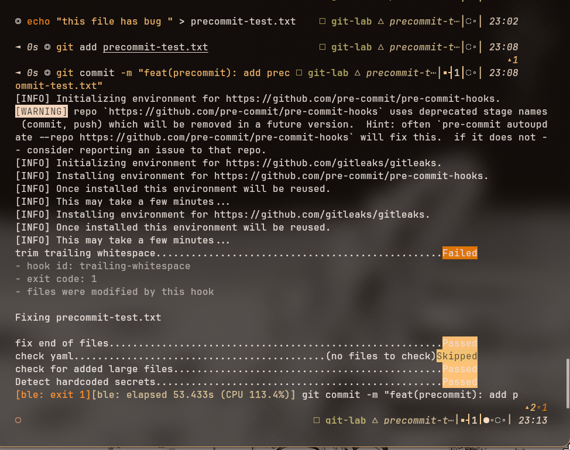

# Task: Advanced Git Hands-on

- **Intern**: Bùi Anh Chiến
- **Phase / Week / Day**: `Phase 1 / Week 1 / Day 3`
- **Branch**: `phase-1/week-1/day-3-git`
- **Submitted at**: `2026-06-19 23:58` (timezone +07)
- **Time spent**: khoảng 6 giờ

## 1. Mục tiêu

Thực hành các thao tác Git nâng cao gồm rebase, xử lý conflict, cherry-pick, squash, reflog và bisect trên repository riêng `git-lab`. Ngoài ra, task còn cấu hình pre-commit hook để kiểm tra code trước khi commit và so sánh ba workflow: Trunk-based, GitFlow và GitHub Flow.

Repository sử dụng:

- Bài nộp: [chiendz11/devops-training-Chien](https://github.com/chiendz11/devops-training-Chien)
- Repository thực hành đã hoàn thành của intern: [chiendz11/git-lab](https://github.com/chiendz11/git-lab)

Repo `chiendz11/git-lab` đã chứa toàn bộ branch và commit sau khi hoàn thành task, vì vậy mentor không dùng repo này để chạy lại từ đầu. Khi reproduce, mentor sẽ tự tạo một repo GitHub mới và clone repo đó về máy.

## 2. Cách chạy

### 2.1. Yêu cầu

Máy mentor cần có:

- Git
- GitHub CLI `gh`
- Python 3 và pip
- Một tài khoản GitHub đã đăng nhập bằng `gh`

Kiểm tra:

```bash
git --version
gh --version
gh auth status
python3 --version
python3 -m pip --version
```

### 2.2. Chuẩn bị hai repository

Hai repository được đặt song song trong cùng thư mục cha:

- `devops-training-Chien`: clone branch bài nộp để đọc hướng dẫn và lưu log reproduce.
- `git-lab`: repo mới do mentor tự tạo để thực hành từ trạng thái sạch.

```bash
mkdir -p git-day3-review
cd git-day3-review

REVIEW_ROOT=$(pwd)
GH_USER=$(gh api user --jq '.login')
LAB_REPO="git-lab-reproduce"

# Clone repository bài nộp.
gh repo clone chiendz11/devops-training-Chien \
  "$REVIEW_ROOT/devops-training-Chien" \
  -- --branch phase-1/week-1/day-3-git --single-branch

# Tạo repo lab mới trên tài khoản GitHub của mentor.
# --add-readme tạo initial commit và branch main.
gh repo create "$GH_USER/$LAB_REPO" \
  --private \
  --add-readme

# Clone repo lab mới vào cùng thư mục cha.
gh repo clone "$GH_USER/$LAB_REPO" \
  "$REVIEW_ROOT/git-lab"

export DAY3_DIR="$REVIEW_ROOT/devops-training-Chien/phase-1/week-1/day-3-git"
export GIT_LAB_DIR="$REVIEW_ROOT/git-lab"
```

Nếu tài khoản đã có repo `git-lab-reproduce`, đổi `LAB_REPO` sang tên khác trước khi chạy `gh repo create`.

Kiểm tra:

```bash
cd "$REVIEW_ROOT/devops-training-Chien"
git branch --show-current

cd "$DAY3_DIR"
ls -la

cd "$GIT_LAB_DIR"
git remote -v
git branch --show-current
git log --oneline --decorate
```

Branch của repo bài nộp phải là:

```text
phase-1/week-1/day-3-git
```

Repo lab mới phải có branch `main`, một initial commit và remote trỏ tới repo của mentor:

```text
main
<sha> Initial commit
origin  git@github.com:<mentor>/git-lab-reproduce.git
```

### 2.3. Kiểm tra repo lab trước khi thực hành

Repo này mới được tạo nên không cần reset lịch sử, xóa remote hoặc checkout commit cũ.

```bash
cd "$GIT_LAB_DIR"

git status
git branch --show-current
git log --oneline --graph --all --decorate
```

Kết quả mong đợi:

- Working tree sạch.
- Branch hiện tại là `main`.
- Repo chỉ có initial commit tạo bởi `--add-readme`.
- Remote `origin` vẫn được giữ để mentor có thể push các branch reproduce nếu muốn.

### 2.4. Part A — Rebase, conflict, cherry-pick và squash

Tạo hàm ghi Git graph vào `history.md` của repo bài nộp:

```bash
cd "$GIT_LAB_DIR"

HISTORY_FILE="$DAY3_DIR/history.md"
printf '# Git History\n' > "$HISTORY_FILE"

snapshot() {
  {
    printf '\n## %s\n\n```text\n' "$1"
    git log --oneline --graph --all --decorate
    printf '```\n'
  } >> "$HISTORY_FILE"
}

snapshot "Initial state"
```

Tạo `feature-a` với ba commit trên ba file:

```bash
snapshot "Before creating feature-a"
git switch -c feature-a main

printf 'APP_NAME=git-lab\nVERSION=A\nOWNER=feature-a\n' > app.conf
git add app.conf
git commit -m "feat: add app.conf"

echo "Feature A file 1" > feature-a-1.txt
git add feature-a-1.txt
git commit -m "feat: add feature-a-1.txt"

echo "Feature A file 2" > feature-a-2.txt
git add feature-a-2.txt
git commit -m "feat: add feature-a-2.txt"

snapshot "After three feature-a commits"
```

Tạo `feature-b` từ `main` và chỉnh cùng file `app.conf`:

```bash
git switch main
snapshot "Before creating feature-b"
git switch -c feature-b

printf 'App version: B' > app.conf
git add app.conf
git commit -m "feat(b): change app version to B"

printf 'App version: B.0.1' > app.conf
git add app.conf
git commit -m "feat(b): fix feature 1"

snapshot "After two feature-b commits"
snapshot "Before rebasing feature-b onto feature-a"
```

Rebase và xử lý conflict:

```bash
git rebase feature-a
git status
nano app.conf
```

Ví dụ nội dung sau khi resolve:

```text
App version: B
```

Tiếp tục cho tới khi rebase hoàn tất:

```bash
git add app.conf
GIT_EDITOR=true git rebase --continue

# Nếu commit tiếp theo tiếp tục conflict:
nano app.conf
git add app.conf
GIT_EDITOR=true git rebase --continue

snapshot "After rebasing and resolving conflicts"
```

Tạo hotfix từ `main` và cherry-pick sang `main`, `feature-a`:

```bash
snapshot "Before creating hotfix"
git switch -c hotfix main

echo "critical bug fixed" > hotfix.txt
git add hotfix.txt
git commit -m "fix: apply critical hotfix"

HOTFIX_COMMIT=$(git rev-parse HEAD)
snapshot "After hotfix commit"

git switch main
snapshot "Before cherry-picking hotfix onto main"
git cherry-pick "$HOTFIX_COMMIT"
snapshot "After cherry-picking hotfix onto main"

git switch feature-a
snapshot "Before cherry-picking hotfix onto feature-a"
git cherry-pick "$HOTFIX_COMMIT"
snapshot "After cherry-picking hotfix onto feature-a"
```

Squash ba feature commit, giữ hotfix là commit riêng:

```bash
snapshot "Before squashing feature-a commits"
git rebase -i HEAD~4
```

Sửa rebase todo:

```text
pick   <sha-a1> feat: add app.conf
squash <sha-a2> feat: add feature-a-1.txt
squash <sha-a3> feat: add feature-a-2.txt
pick   <sha-hotfix> fix: apply critical hotfix
```

Sau khi lưu và đóng editor:

```bash
snapshot "After squashing feature-a commits"
git log --oneline --graph --all --decorate
```

SHA trong lần reproduce có thể khác vì author time và commit time khác nhau. Mentor có thể đối chiếu cấu trúc graph trong [history.md](./history.md).

### 2.5. Part B — Khôi phục commit bằng reflog

```bash
cd "$GIT_LAB_DIR"
git switch -c reflog-lab main

echo "This commit will be recovered" > lost-file.txt
git add lost-file.txt
git commit -m "feat(reflog): add file to recover"

git reset --hard HEAD~1
git reflog --oneline
```

Tìm và khôi phục commit:

```bash
LOST_COMMIT=$(
  git reflog --format='%H %gs' |
  awk '/commit: feat\(reflog\): add file to recover/ { print $1; exit }'
)

git switch -c recovered "$LOST_COMMIT"

git branch --show-current
git log --oneline --graph --all --decorate
cat lost-file.txt
```

Giải thích chi tiết: [reflog-lab.md](./reflog-lab.md).

### 2.6. Part C — Tìm commit lỗi bằng Git bisect

Tạo `bug-hunt` với 20 commit; commit thứ 13 đổi output của `app.py` từ `OK` thành `BUG`:

```bash
cd "$GIT_LAB_DIR"
git switch -c bug-hunt main

BASE_COMMIT=$(git rev-parse HEAD)

for i in $(seq 1 20); do
  printf 'Change %02d\n' "$i" >> progress.txt

  if [ "$i" -eq 1 ]; then
    echo 'print("OK")' > app.py
  fi

  if [ "$i" -eq 13 ]; then
    echo 'print("BUG")' > app.py
  fi

  git add progress.txt app.py
  git commit -m "chore: bug hunt commit $i"
done

git rev-list --count "$BASE_COMMIT"..HEAD
python3 app.py
```

Chạy bisect và ghi toàn bộ command/output vào repo bài nộp:

```bash
(
  set -x
  git bisect start
  git bisect bad HEAD
  git bisect good "$BASE_COMMIT"
  git bisect run bash -c \
    'test ! -f app.py || test "$(python3 app.py)" = "OK"'
  git bisect log
  git bisect reset
) 2>&1 | tee "$DAY3_DIR/bisect.log"
```

Kiểm tra:

```bash
grep -F "first bad commit" "$DAY3_DIR/bisect.log"
```

Kết quả phải tìm được:

```text
chore: bug hunt commit 13
```

Transcript đã nộp: [bisect.log](./bisect.log).

### 2.7. Part D — Pre-commit hook

Cài `pre-commit` trực tiếp bằng pip:

```bash
python3 -m pip install --user pre-commit
export PATH="$HOME/.local/bin:$PATH"
pre-commit --version
```

Tạo branch:

```bash
cd "$GIT_LAB_DIR"
git switch -c precommit-test main
```

Tạo `.pre-commit-config.yaml`:

```bash
nano .pre-commit-config.yaml
```

```yaml
repos:
  - repo: https://github.com/pre-commit/pre-commit-hooks
    rev: v4.5.0
    hooks:
      - id: trailing-whitespace
      - id: end-of-file-fixer
      - id: check-yaml
      - id: check-added-large-files
  - repo: https://github.com/gitleaks/gitleaks
    rev: v8.18.0
    hooks:
      - id: gitleaks
```

Cài và chạy hook:

```bash
pre-commit install
pre-commit run --all-files
```

Tạo file có trailing whitespace và thử commit:

```bash
printf 'this file has trailing whitespace   \n' > precommit-test.txt

git add precommit-test.txt
git commit -m "test(precommit): add file with trailing whitespace"
```

Lần đầu commit phải bị block và `trailing-whitespace` tự sửa file. Sau khi kiểm tra thay đổi, stage lại và commit:

```bash
git diff
git add precommit-test.txt .pre-commit-config.yaml
git commit -m "test(precommit): verify pre-commit hooks"
```

Minh chứng:



Sau khi reproduce xong, có thể gỡ hook, cache và package:

```bash
cd "$GIT_LAB_DIR"

pre-commit uninstall
pre-commit clean
python3 -m pip uninstall pre-commit

git switch main
git branch -D precommit-test
rm -f precommit-test.txt .pre-commit-config.yaml
```

### 2.8. Part E — So sánh workflow

Phần so sánh Trunk-based Development, GitFlow và GitHub Flow được trình bày tại [workflow-comparison.md](./workflow-comparison.md), gồm:

- Số lượng và vai trò của long-lived branch.
- Scenario phù hợp.
- Release cadence.
- Ưu điểm và hạn chế.
- Cách kết hợp với CI/CD, staging, production, branch protection và rollback.

## 3. Kết quả

Các artifact của bài nộp:

| Part | Kết quả |
|---|---|
| Part A | [history.md](./history.md) — Git graph trước và sau các bước rebase, cherry-pick và squash |
| Part B | [reflog-lab.md](./reflog-lab.md) và [recovered-branch.png](./screenshots/recovered-branch.png) |
| Part C | [bisect.log](./bisect.log), [make-bugs.png](./screenshots/make-bugs.png) và [bug-found.png](./screenshots/bug_found.png) |
| Part D | [part-D-precommit.png](./screenshots/part-D-precommit.png) |
| Part E | [workflow-comparison.md](./workflow-comparison.md) |

Kết quả chính:

- `feature-b` được rebase lên `feature-a` và conflict trong `app.conf` được resolve thủ công.
- Hotfix được cherry-pick sang cả `main` và `feature-a`.
- Ba commit của `feature-a` được squash thành một commit.
- Commit bị reset được khôi phục vào branch `recovered` bằng reflog.
- Bisect tìm đúng `chore: bug hunt commit 13` là first bad commit.
- Pre-commit block lần commit đầu tiên do trailing whitespace.

## 4. Khó khăn & cách giải quyết

- **Ghi Git graph vào repo bài nộp trong khi thao tác ở repo `git-lab`**: dùng biến `DAY3_DIR` chứa đường dẫn tuyệt đối và hàm `snapshot`, nhờ đó `history.md` luôn được ghi đúng thư mục.

- **Chủ động tạo và xử lý conflict khi rebase**: cho `feature-a` và `feature-b` cùng tạo `app.conf` với nội dung khác nhau. Khi rebase dừng, xóa conflict marker, giữ nội dung cần thiết rồi chạy `git rebase --continue`.

- **Commit biến mất sau `git reset --hard`**: dùng `git reflog` tìm SHA cũ của `HEAD`, sau đó tạo branch `recovered` trỏ tới SHA đó để commit không bị garbage collection.

- **Transcript từ lệnh `script` chứa prompt, màu và ký tự điều khiển**: dùng subshell với `set -x`, chuyển `stderr` sang `stdout` bằng `2>&1`, rồi pipe qua `tee bisect.log`. Log vẫn có command và output nhưng không chứa giao diện terminal.

- **Xác định good commit khi base chưa có `app.py`**: test của `git bisect run` coi trạng thái chưa có `app.py` là chưa xuất hiện bug: `test ! -f app.py || test "$(python3 app.py)" = "OK"`.

- **Pre-commit tự sửa file nhưng vẫn block commit**: đây là hành vi đúng. Hook trả exit code khác `0` để developer review phần đã sửa, sau đó cần `git add` lại file và commit lần nữa.

## 5. Reference

- [Git rebase documentation](https://git-scm.com/docs/git-rebase)
- [Git cherry-pick documentation](https://git-scm.com/docs/git-cherry-pick)
- [Git reflog documentation](https://git-scm.com/docs/git-reflog)
- [Git bisect documentation](https://git-scm.com/docs/git-bisect)
- [Git hooks documentation](https://git-scm.com/docs/githooks)
- [pre-commit documentation](https://pre-commit.com/)
- [pre-commit hooks](https://github.com/pre-commit/pre-commit-hooks)
- [Gitleaks](https://github.com/gitleaks/gitleaks)
- [GitHub Flow](https://docs.github.com/get-started/quickstart/github-flow)
- [GitHub Actions environments](https://docs.github.com/actions/deployment/targeting-different-environments/using-environments-for-deployment)
- [Trunk-based Development](https://trunkbaseddevelopment.com/)
- [A successful Git branching model](https://nvie.com/posts/a-successful-git-branching-model/)

## 6. Self-check

- [ ] Code chạy được trên một máy sạch hoàn toàn.
- [x] README có hướng dẫn mentor reproduce.
- [x] Không hard-code secret.
- [x] Commit message theo Conventional Commits.
- [x] Đã review lại nội dung và command một lượt.
