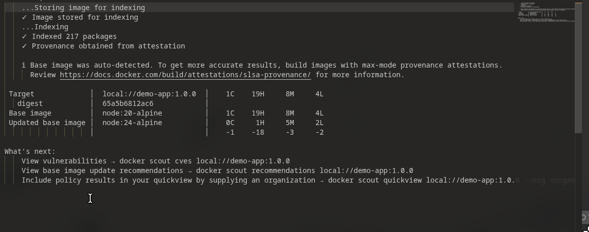

# Task: Docker Fundamentals, Image Build, Network và Storage

- **Intern**: Bùi Anh Chiến
- **Phase / Week / Day**: `Phase 1 / Week 1 / Day 5`
- **Branch**: `phase-1/week-1/day-5-docker`
- **Submitted at**: `2026-06-22 00:37` (timezone +07)
- **Time spent**: khoảng 5 giờ

## 1. Mục tiêu

Task này giúp em hiểu Docker image, layer cache, Dockerfile và cách chạy container an toàn bằng non-root user. Em cũng thực hành Docker network, volume, bind mount, push image lên Docker Hub và so sánh size/security giữa các Node.js base image.

## 2. Cách chạy

### 2.1. Yêu cầu

Máy mentor cần có:

- Git.
- Docker Engine và Buildx.
- `curl`.
- Tài khoản Docker Hub nếu muốn reproduce Part D.

Kiểm tra:

```bash
git --version
docker version
docker buildx version
curl --version
```

Clone đúng branch:

```bash
git clone \
  --branch phase-1/week-1/day-5-docker \
  --single-branch \
  git@github.com:chiendz11/devops-training-Chien.git

cd devops-training-Chien/phase-1/week-1/day-5-docker
```

### 2.2. Part A — Image internals

Phần trả lời lý thuyết nằm trong [notes.md](./notes.md), gồm:

- Cấu trúc image và lý do layer được cache.
- `COPY` và `ADD`.
- `CMD` và `ENTRYPOINT`.
- Vai trò của `.dockerignore`.
- Ý nghĩa thật sự của `EXPOSE`.
- Lý do không nên chạy container bằng root.

Pull và xem lịch sử layer của Nginx:

```bash
docker pull nginx:1.27-alpine
docker history nginx:1.27-alpine
```

Nếu máy đã cài Dive:

```bash
dive nginx:1.27-alpine
```

Ảnh minh chứng:

- [docker pull nginx](./screenshots/docker-pull-nginx.png)
- [docker history](./screenshots/docker-nginx-history.png)
- [dive nginx](./screenshots/dive-nginx.png)

### 2.3. Part B — Dockerize Node.js app

Source code: [app/server.js](./app/server.js).

Dockerfile chính sử dụng:

- Builder stage: `node:20`.
- Runtime stage: `node:20-alpine`.
- `USER node`.
- OCI labels.
- Healthcheck.
- Multi-stage build.

Build image:

```bash
docker build -t demo-app:1.0.0 .
```

Chạy container:

```bash
docker run --rm \
  --name demo-app-local \
  -p 3000:3000 \
  -e NAME=phase1 \
  demo-app:1.0.0
```

Terminal khác:

```bash
curl http://localhost:3000
```

Output:

```json
{"msg":"hello from phase1","ts":...}
```

Kiểm tra user:

```bash
docker exec demo-app-local id
```

Output:

```text
uid=1000(node) gid=1000(node) groups=1000(node)
```

Kiểm tra healthcheck:

```bash
docker inspect demo-app-local \
  --format '{{.State.Health.Status}}'
```

Healthcheck chạy theo interval nên ban đầu có thể là `starting`, sau đó chuyển thành:

```text
healthy
```

Kiểm tra size:

```bash
docker image ls demo-app
```

Kết quả trên máy em:

```text
REPOSITORY   TAG       SIZE
demo-app     1.0.0     193MB
```

Ảnh minh chứng:

- [docker build](<./screenshots/docker build -t demo-app:1.0.0 ..png>)
- [docker run](<./screenshots/docker run --rm -p 3000:3000 -e NAME=phase1 demo-app:1.0.0.png>)
- [curl localhost](./screenshots/curl-localhost-3000.png)
- [image size](./screenshots/perfect-size.png)

### 2.4. Part C — Network và volume

Các command, output và giải thích đầy đủ nằm trong [network-volume.md](./network-volume.md).

Kết quả chính:

- Tạo user-defined bridge network `demo-net`.
- `app1` gọi được `http://app2:3000` bằng Docker DNS.
- PostgreSQL lưu dữ liệu trong named volume `pgdata`.
- Dữ liệu vẫn tồn tại sau khi xóa và tạo lại container PostgreSQL.
- Nginx đọc static file qua bind mount; sửa file trên host thì response thay đổi ngay.

### 2.5. Part D — Push image lên Docker Hub

Login:

```bash
docker login
```

Tag image:

```bash
docker tag demo-app:1.0.0 \
  chiendz11/demo-app:1.0.0
```

Push:

```bash
docker push chiendz11/demo-app:1.0.0
```

Verify bằng cách bắt buộc pull lại image từ registry:

```bash
docker run --pull=always --rm \
  --name demo-app-dockerhub \
  -p 3000:3000 \
  -e NAME=dockerhub \
  chiendz11/demo-app:1.0.0
```

Terminal khác:

```bash
curl http://localhost:3000
```

Output:

```json
{"msg":"hello from dockerhub","ts":...}
```

Image trên Docker Hub:

- [chiendz11/demo-app:1.0.0](https://hub.docker.com/r/chiendz11/demo-app/tags)

Ảnh minh chứng:

- [docker login](./screenshots/docker-login.png)
- [docker tag](./screenshots/docker-tag-change.png)
- [docker push](./screenshots/docker-push.png)
- [verify image Docker Hub](./screenshots/verify-running-docker-hub-image.png)

### 2.6. Part E — Scan image và so sánh base image

#### Scan bằng Docker Scout

Docker Engine trên Linux có thể không cài sẵn Docker Scout. Kiểm tra:

```bash
docker scout version
```

Nếu chưa có, cài theo script chính thức. Em tải script về trước để có thể đọc lại nội dung:

```bash
curl -fsSL \
  https://raw.githubusercontent.com/docker/scout-cli/main/install.sh \
  -o /tmp/install-scout.sh

less /tmp/install-scout.sh
sh /tmp/install-scout.sh

docker scout version
```

Scan nhanh image local:

```bash
mkdir -p reports

docker scout quickview \
  local://demo-app:1.0.0 \
  2>&1 | tee reports/scout-quickview.txt
```

Xem chi tiết CVE mức High và Critical:

```bash
docker scout cves \
  --only-severity high,critical \
  local://demo-app:1.0.0 \
  2>&1 | tee reports/scout-cves.txt
```

`local://` yêu cầu Scout chỉ dùng image trong local image store, không tự fallback sang registry.

Ảnh kết quả em đã chạy:



Report dạng text: [reports/scout-quickview.txt](./reports/scout-quickview.txt).

Output chính:

```text
✓ Indexed 217 packages
✓ Provenance obtained from attestation

Target             local://demo-app:1.0.0     1C  19H  8M  4L
Base image         node:20-alpine             1C  19H  8M  4L
Updated base image node:24-alpine             0C   1H  5M  2L
```

Giải thích:

- `Indexed 217 packages`: Scout tạo SBOM và nhận diện 217 package/thành phần trong image. Con số này gồm package của Alpine, Node.js runtime và metadata liên quan, không có nghĩa source app đã khai báo 217 npm dependency.
- `Provenance obtained from attestation`: image có provenance attestation do BuildKit tạo. Scout dùng metadata này để xác định quá trình build và base image.
- `Target local://demo-app:1.0.0`: image được scan trực tiếp từ local Docker image store.
- `digest 65a5b6812ac6`: định danh nội dung của image. Digest giúp xác định chính xác image đã scan thay vì chỉ dựa vào tag có thể thay đổi.
- `1C 19H 8M 4L`: Scout tìm thấy `1 Critical`, `19 High`, `8 Medium`, `4 Low` tại thời điểm scan.
- Dòng `Base image node:20-alpine` có cùng số CVE với target. App của em chỉ copy một file JavaScript và không cài npm package, nên kết quả cho thấy phần lớn vấn đề đến từ base image/runtime thay vì dependency của application.
- Scout đề xuất `node:24-alpine` và ước tính còn `0 Critical`, `1 High`, `5 Medium`, `2 Low`, tức giảm `1 Critical`, `18 High`, `3 Medium`, `2 Low`.


Lưu ý: vulnerability database thay đổi theo thời gian nên số CVE mentor nhận được có thể khác kết quả lúc em làm bài.

#### Build bốn runtime variant

Dockerfile chính đại diện cho `node:20-alpine`. Ba Dockerfile benchmark còn lại nằm trong [variants](./variants/).

```bash
docker build \
  -f variants/Dockerfile.node \
  -t demo-app:node20 .

docker build \
  -f Dockerfile \
  -t demo-app:node20-alpine .

docker build \
  -f variants/Dockerfile.slim \
  -t demo-app:node20-slim .

docker build \
  -f variants/Dockerfile.distroless \
  -t demo-app:distroless .
```

Kiểm tra size:

```bash
docker image ls demo-app \
  --format 'table {{.Repository}}\t{{.Tag}}\t{{.Size}}'
```

Kết quả thực tế trên máy em:

| Runtime base | Tag | Size từ `docker image ls` |
|---|---|---:|
| `node:20` | `demo-app:node20` | 1.58GB |
| `node:20-slim` | `demo-app:node20-slim` | 290MB |
| `node:20-alpine` | `demo-app:node20-alpine` | 193MB |
| `gcr.io/distroless/nodejs20-debian12:nonroot` | `demo-app:distroless` | 170MB |

Size có thể thay đổi theo ngày build, platform và digest hiện tại của base image.

#### Nhận xét

**`node:20`**

- Lớn nhất vì chứa Debian đầy đủ và nhiều tool/package tiện cho development.
- Debug dễ hơn nhưng không hợp lý cho runtime app nhỏ.
- Nhiều package hơn cũng tạo thêm bề mặt cần scan và patch.

**`node:20-slim`**

- Nhỏ hơn bản đầy đủ và vẫn dùng Debian/glibc.
- Thường tương thích dependency native dễ hơn Alpine.
- Trong kết quả này vẫn lớn hơn giới hạn 200MB.

**`node:20-alpine`**

- Nhỏ, có package manager `apk` và shell nên vẫn debug được.
- Dùng musl libc thay vì glibc; một số native dependency có thể cần package bổ sung hoặc gặp vấn đề tương thích.
- Phù hợp yêu cầu Part B vì image cuối dưới 200MB.

**Distroless Node.js**

- Nhỏ nhất trong lần build này.
- Không có shell và package manager, giảm thành phần dư thừa trong runtime.
- Khó debug trực tiếp bằng `docker exec ... sh`.
- Cần chuẩn bị app và dependency hoàn chỉnh từ builder stage.
- Variant `nonroot` dùng UID/GID `65532` thay cho user `node`.


## 3. Kết quả

### Cấu trúc bài nộp

```text
day-5-docker/
├── README.md
├── notes.md
├── app/
│   └── server.js
├── Dockerfile
├── .dockerignore
├── network-volume.md
├── reports/
│   └── scout-quickview.txt
├── variants/
│   ├── Dockerfile.node
│   ├── Dockerfile.slim
│   └── Dockerfile.distroless
└── screenshots/
```

Kết quả chính:

- Image `demo-app:1.0.0` build thành công và có size 193MB.
- Container chạy bằng user `node` và có healthcheck.
- `app1` kết nối được tới `app2` qua `demo-net`.
- PostgreSQL giữ dữ liệu bằng named volume.
- Nginx phản ánh thay đổi bind mount từ host.
- Image đã được push lên Docker Hub và pull/run lại thành công.
- Docker Scout đã index 217 package và báo `1 Critical`, `19 High`, `8 Medium`, `4 Low`.
- Distroless là variant nhỏ nhất trong lần benchmark: 170MB.

## 4. Khó khăn & cách giải quyết

- **Port `3000` vẫn bị chiếm sau lần chạy trước:** khi verify image Docker Hub, Docker báo `Bind for 0.0.0.0:3000 failed: port is already allocated`. Dù trước đó terminal đã nhận tín hiệu `SIGINT`/`SIGTERM`, một container cũ tên `kind_khayyam` vẫn còn chạy và publish port `3000`. Em dùng `docker ps --filter publish=3000` để tìm container rồi chạy `docker rm -f kind_khayyam`. Em cũng thêm `--name` vào các lệnh sau để dễ quản lý container thay vì dùng tên Docker tạo ngẫu nhiên.

- **`--rm` không xóa container nếu container chưa thực sự dừng:** option này chỉ xóa sau khi process chính trong container đã exit. Vì vậy sau khi `Ctrl+C`, em vẫn kiểm tra lại bằng `docker ps` thay vì mặc định cho rằng port đã được giải phóng.

- **Image Alpine không có `curl`:** khi chạy `docker exec app1 curl http://app2:3000`, Docker báo không tìm thấy executable. Em dùng `docker exec -u root app1 apk add --no-cache curl`, sau đó app vẫn chạy bằng user `node`.

- **Restart PostgreSQL chưa chứng minh hoàn toàn volume persistence:** restart vẫn giữ writable layer của container. Em xóa hẳn container, tạo container mới và mount lại `pgdata`; bản ghi cũ vẫn còn nên mới chứng minh dữ liệu nằm trong volume.

- **Phân biệt bind mount và named volume:** named volume phù hợp dữ liệu database do Docker quản lý; bind mount phù hợp file cần sửa trực tiếp từ host như HTML/config.

- **Docker Scout không có sẵn trong Docker Engine:** lệnh `docker scout` ban đầu trả về `unknown command`. Em cài Scout CLI theo hướng dẫn chính thức, sau đó chạy `quickview` thành công và lưu cả screenshot lẫn text report.

- **Scout đề xuất nâng từ Node.js 20 lên Node.js 24:** recommendation giúp giảm nhiều CVE nhưng đây là major-version upgrade. Em không thay base image chính ngay mà ghi nhận đề xuất, sau đó cần kiểm thử compatibility trước khi áp dụng.

- **Distroless không có shell và user `node`:** em dùng image `:nonroot`, copy file với UID/GID `65532`, dùng đường dẫn `/nodejs/bin/node` cho healthcheck và chỉ truyền `server.js` vào `CMD` vì image đã có Node.js entrypoint.

- **Size hiển thị có thể khác registry:** `docker image ls` hiển thị dung lượng image local theo Docker storage; dung lượng tải từ registry thường là các layer đã nén. Khi so sánh, em dùng cùng một lệnh trên cùng một máy để kết quả nhất quán.

## 5. Reference

- [Docker image layers](https://docs.docker.com/get-started/docker-concepts/building-images/understanding-image-layers/)
- [Dockerfile reference](https://docs.docker.com/reference/dockerfile/)
- [Docker multi-stage builds](https://docs.docker.com/build/building/multi-stage/)
- [Docker bridge networks](https://docs.docker.com/engine/network/drivers/bridge/)
- [Docker volumes](https://docs.docker.com/engine/storage/volumes/)
- [Docker bind mounts](https://docs.docker.com/engine/storage/bind-mounts/)
- [Docker Hub push workflow](https://docs.docker.com/docker-hub/repos/manage/hub-images/push/)
- [Docker Scout installation](https://docs.docker.com/scout/install/)
- [Docker Scout image analysis](https://docs.docker.com/scout/explore/analysis/)
- [Trivy container image scanning](https://trivy.dev/docs/latest/guide/target/container_image/)

## 6. Self-check

- [ ] Toàn bộ command đã được kiểm tra trên một máy sạch.
- [x] README có hướng dẫn reproduce Part A–E.
- [x] Không hard-code Docker Hub password hoặc token.
- [x] Commit message sử dụng Conventional Commits.
- [x] Image chính chạy bằng non-root user và có healthcheck.
- [x] Image chính nhỏ hơn 200MB theo `docker image ls`.
- [x] Đã build và chạy thử đủ bốn runtime variant.
- [x] Đã chạy Docker Scout thành công và lưu screenshot/report.
- [x] Đã review lại code, command và artifact một lượt.
