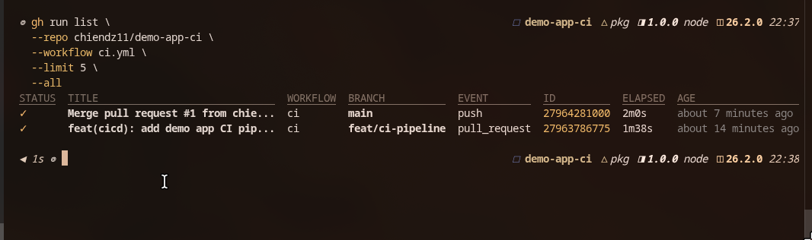
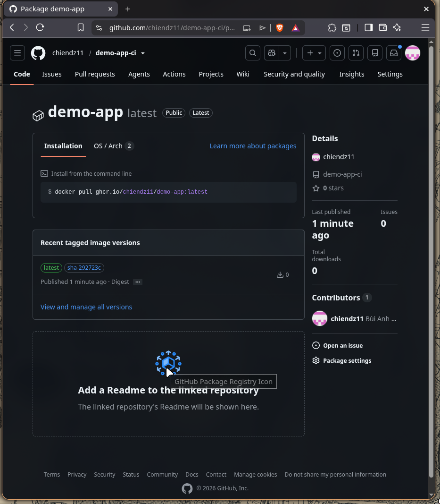
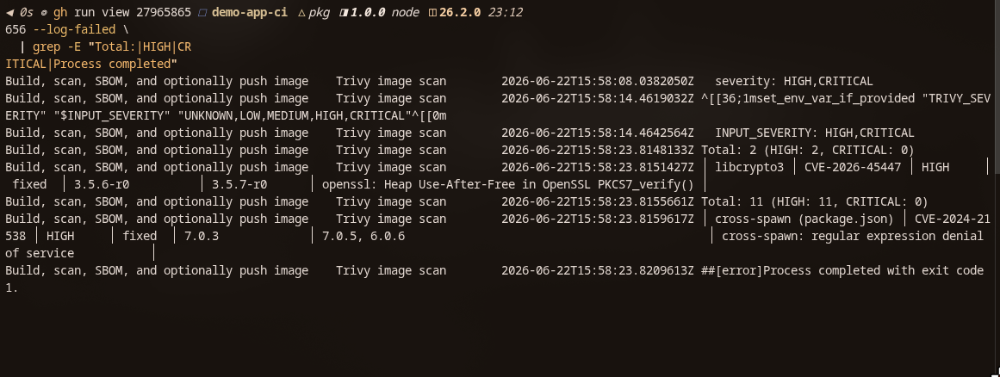

# Day 1 — CI/CD Basics

> Mỗi task = 1 thư mục con + 1 PR/MR riêng. README này ghi lại cách em làm bài Day 1 CI/CD basics.

## Task: `CI/CD basics`

- **Intern**: `Bùi Anh Chiến`
- **Phase / Week / Day**: `Phase 1 / Week 2 / Day 1`
- **Branch**: `phase-1/week-2/day-1-cicd-basics`
- **Submitted at**: `2026-06-22 23:38` (timezone +07)
- **Time spent**: `khoảng 4 giờ`

## 1. Mục tiêu

Task này gồm 3 phần chính:

- Part A: ghi chú lý thuyết về CI/CD, Continuous Deployment, DORA metrics, Pipeline as Code, GitHub-hosted runner và self-hosted runner trong `notes.md`.
- Part B: tạo pipeline CI/CD cho demo app Node.js ở Day 5, gồm lint, test, build Docker image và push image lên GHCR khi push vào `main`.
- Part C: bonus thêm Trivy scan image và tạo SBOM bằng Syft/Anchore.

Vì repo `devops-training-Chien` là repo nộp bài theo cấu trúc `phase-1/week-x/day-x`, nên phần workflow chạy thật em tách sang repo demo app riêng:

- Repo có workflow: <https://github.com/chiendz11/demo-app-ci>
- Workflow file: <https://github.com/chiendz11/demo-app-ci/blob/main/.github/workflows/ci-trivy.yml>
- GHCR image: <https://github.com/users/chiendz11/packages/container/package/demo-app>
- Image pull được bằng: `ghcr.io/chiendz11/demo-app:latest`
- Pipeline pass chính: Run `#3` — <https://github.com/chiendz11/demo-app-ci/actions/runs/27965676541>

## 2. Cách chạy

Phần này mô phỏng lại toàn bộ quá trình trên một repo GitHub mới, không dùng trực tiếp repo `demo-app-ci` đã hoàn thành.

### 2.1. Chuẩn bị

Máy mentor cần có:

- Git.
- GitHub CLI (`gh`) và đã đăng nhập.
- Node.js 20 và npm.
- Docker.

```bash
gh auth status
node --version
npm --version
docker --version
```

### 2.2. Tạo một repo GitHub mới

Đặt tên repo test. Nếu tên này đã tồn tại thì đổi sang tên khác:

```bash
export GITHUB_USER="$(gh api user --jq .login)"
export REPO="demo-app-ci-reproduce"

mkdir "$REPO"
cd "$REPO"
git init -b main
```

Để tập trung vào phần CI/CD, mentor có thể lấy lại source app, test và Dockerfile mẫu từ repo em đã làm:

```bash
SOURCE_DIR="$(mktemp -d)"

git clone --depth 1 \
  https://github.com/chiendz11/demo-app-ci.git \
  "$SOURCE_DIR"

cp -R "$SOURCE_DIR/app" .
cp -R "$SOURCE_DIR/test" .
cp "$SOURCE_DIR/package.json" .
cp "$SOURCE_DIR/package-lock.json" .
cp "$SOURCE_DIR/eslint.config.js" .
cp "$SOURCE_DIR/Dockerfile" .
cp "$SOURCE_DIR/.dockerignore" .
cp "$SOURCE_DIR/.gitignore" .

rm -rf "$SOURCE_DIR"
```

Kiểm tra app trước khi đưa lên GitHub:

```bash
npm ci
npm run lint
npm test
docker build -t demo-app:reproduce .
```

Tạo initial commit, sau đó dùng `gh` tạo repo GitHub và push branch `main`:

```bash
git add .
git commit -m "feat(app): add demo application"

gh repo create "$GITHUB_USER/$REPO" \
  --public \
  --source=. \
  --remote=origin \
  --push
```

Lệnh trên thực hiện các việc:

- Tạo repo mới trên GitHub.
- Thêm remote tên `origin`.
- Push branch `main` local lên GitHub.
- Thiết lập branch `main` local track `origin/main`.

### 2.3. Tạo branch làm CI/CD

Không sửa trực tiếp trên `main`. Tạo branch riêng để sau đó mở Pull Request:

```bash
git switch -c feat/ci-pipeline
mkdir -p .github/workflows
```

### 2.4. Tạo workflow `ci-trivy.yml`

Tạo file `.github/workflows/ci-trivy.yml` với nội dung sau:

```yaml
name: ci

on:
  push:
    branches: [main]
  pull_request:
    branches: [main]

permissions:
  contents: read

concurrency:
  group: ci-${{ github.workflow }}-${{ github.ref }}
  cancel-in-progress: true

env:
  NODE_VERSION: '20'
  IMAGE_NAME: demo-app

jobs:
  lint:
    name: Lint
    runs-on: ubuntu-latest

    steps:
      - name: Checkout source code
        uses: actions/checkout@v4

      - name: Setup Node.js
        uses: actions/setup-node@v4
        with:
          node-version: ${{ env.NODE_VERSION }}
          cache: npm

      - name: Install dependencies
        run: npm ci

      - name: Run ESLint
        run: npm run lint

  test:
    name: Unit test
    needs: lint
    runs-on: ubuntu-latest

    steps:
      - name: Checkout source code
        uses: actions/checkout@v4

      - name: Setup Node.js
        uses: actions/setup-node@v4
        with:
          node-version: ${{ env.NODE_VERSION }}
          cache: npm

      - name: Install dependencies
        run: npm ci

      - name: Run unit tests
        run: npm test

  docker:
    name: Build, scan, SBOM, and optionally push image
    needs: test
    runs-on: ubuntu-latest

    permissions:
      contents: read
      packages: write

    steps:
      - name: Checkout source code
        uses: actions/checkout@v4

      - name: Prepare image metadata
        id: image
        shell: bash
        run: |
          echo "registry_name=ghcr.io/${GITHUB_REPOSITORY_OWNER,,}/${IMAGE_NAME}" >> "$GITHUB_OUTPUT"
          echo "short_sha=${GITHUB_SHA::7}" >> "$GITHUB_OUTPUT"
          echo "local_tag=${IMAGE_NAME}:ci-${GITHUB_SHA::7}" >> "$GITHUB_OUTPUT"

      - name: Setup Docker Buildx
        uses: docker/setup-buildx-action@v3

      - name: Build image locally
        uses: docker/build-push-action@v6
        with:
          context: .
          load: true
          tags: |
            ${{ steps.image.outputs.local_tag }}
            ${{ steps.image.outputs.registry_name }}:sha-${{ steps.image.outputs.short_sha }}
            ${{ steps.image.outputs.registry_name }}:latest
          cache-from: type=gha
          cache-to: type=gha,mode=max

      - name: Generate and upload SBOM
        uses: anchore/sbom-action@v0
        with:
          image: ${{ steps.image.outputs.local_tag }}
          format: spdx-json
          artifact-name: sbom-${{ steps.image.outputs.short_sha }}.spdx.json
          upload-artifact: true

      - name: Trivy image scan
        uses: aquasecurity/trivy-action@v0.36.0
        with:
          scan-type: image
          image-ref: ${{ steps.image.outputs.local_tag }}
          format: table
          vuln-type: os,library
          severity: HIGH,CRITICAL
          exit-code: '1'

      - name: Login to GHCR
        if: github.event_name == 'push' && github.ref == 'refs/heads/main'
        uses: docker/login-action@v3
        with:
          registry: ghcr.io
          username: ${{ github.actor }}
          password: ${{ secrets.GITHUB_TOKEN }}

      - name: Push image to GHCR
        if: github.event_name == 'push' && github.ref == 'refs/heads/main'
        shell: bash
        run: |
          docker push "${{ steps.image.outputs.registry_name }}:sha-${{ steps.image.outputs.short_sha }}"
          docker push "${{ steps.image.outputs.registry_name }}:latest"
```

Thứ tự quan trọng trong job `docker` là:

```text
Build image
    ↓
Generate and upload SBOM
    ↓
Trivy scan
    ↓
Push image nếu đang chạy trên main và scan pass
```

SBOM phải được tạo trước Trivy. Nếu Trivy phát hiện CVE và trả về exit code `1`, các step phía sau sẽ không chạy nhưng SBOM đã được upload thành artifact.

### 2.5. Commit và push branch

```bash
git add .github/workflows/ci-trivy.yml
git commit -m "feat(cicd): add CI pipeline with security scan"
git push -u origin feat/ci-pipeline
```

Push branch này chưa push image lên GHCR vì workflow chỉ push image khi event là `push` vào branch `main`.

### 2.6. Mở Pull Request

```bash
gh pr create \
  --base main \
  --head feat/ci-pipeline \
  --title "feat(cicd): add demo app CI pipeline" \
  --body "Add lint, unit test, Docker build, SBOM, Trivy scan and GHCR push."
```

Theo dõi workflow của Pull Request:

```bash
gh pr checks --watch

PR_RUN_ID="$(
  gh run list \
    --workflow ci-trivy.yml \
    --branch feat/ci-pipeline \
    --event pull_request \
    --limit 1 \
    --json databaseId \
    --jq '.[0].databaseId'
)"

gh run view "$PR_RUN_ID"
```

Ở event `pull_request`, pipeline sẽ:

- Chạy lint.
- Chạy unit test.
- Build Docker image.
- Tạo và upload SBOM.
- Scan image bằng Trivy.
- Không login và không push image lên GHCR.

Nếu Trivy phát hiện `HIGH` hoặc `CRITICAL`, PR check sẽ fail đúng theo yêu cầu của security gate. Trong trang workflow run, vào phần **Artifacts** để tải file `sbom-<short_sha>.spdx.json`.

Có thể tải SBOM bằng GitHub CLI:

```bash
mkdir -p artifacts

gh run download "$PR_RUN_ID" \
  --pattern 'sbom-*' \
  --dir artifacts
```

### 2.7. Merge PR và trigger push lên `main`

Chỉ merge khi toàn bộ check đã pass:

```bash
gh pr merge \
  --merge \
  --delete-branch
```

Sau khi merge, GitHub tạo event `push` trên `main`. Workflow chạy lại và chỉ khi lint, test, build, SBOM và Trivy đều thành công thì hai step cuối mới push image lên GHCR.

Theo dõi run mới nhất:

```bash
gh run list \
  --workflow ci-trivy.yml \
  --limit 5

MAIN_RUN_ID="$(
  gh run list \
    --workflow ci-trivy.yml \
    --branch main \
    --event push \
    --limit 1 \
    --json databaseId \
    --jq '.[0].databaseId'
)"

gh run watch "$MAIN_RUN_ID"
```

### 2.8. Verify GHCR image

Sau lần push image đầu tiên, vào:

```text
GitHub profile
→ Packages
→ demo-app
→ Package settings
→ Change visibility
→ Public
```

Việc này giúp mentor kiểm tra image public mà không phụ thuộc Docker login của tài khoản tạo package.

Đổi `<github-user>` thành username của mentor:

```bash
docker pull ghcr.io/<github-user>/demo-app:latest

docker run --rm \
  --name demo-app-ghcr \
  -p 3000:3000 \
  -e NAME=ghcr \
  ghcr.io/<github-user>/demo-app:latest
```

Mở terminal khác:

```bash
curl http://localhost:3000
```

Output mong đợi có dạng:

```json
{"msg":"hello from ghcr","ts":1782140000000}
```

Nếu port `3000` đang được sử dụng thì đổi mapping thành `-p 3001:3000` và gọi `curl http://localhost:3001`.

## 3. Kết quả

### Part A — Lý thuyết

Em đã trả lời trong file:

- `notes.md`

Nội dung chính:

- CI / CD / Continuous Deployment khác nhau thế nào.
- DORA 4 key metrics và ý nghĩa từng metric.
- Vì sao Pipeline as Code tốt hơn cấu hình UI.
- Khi nào dùng `runs-on: ubuntu-latest`, khi nào dùng `runs-on: self-hosted`.

### Part B — Pipeline demo-app

Repo workflow: <https://github.com/chiendz11/demo-app-ci>

Pipeline gồm các job:

- `lint`: chạy ESLint.
- `test`: chạy unit test bằng `node:test`.
- `docker`: build Docker image bằng Buildx.
- Push image lên GHCR khi event là `push` vào `main`.

Image tag:

```text
ghcr.io/chiendz11/demo-app:sha-<short_sha>
ghcr.io/chiendz11/demo-app:latest
```

Pipeline pass chính:

- Run number: `#3`
- Run URL: <https://github.com/chiendz11/demo-app-ci/actions/runs/27965676541>

Ảnh minh chứng:



GHCR package:



### Part C — Bonus security scan + SBOM

Em thêm Trivy scan image với policy:

```yaml
severity: HIGH,CRITICAL
exit-code: '1'
```

Nghĩa là nếu image có CVE mức `HIGH` hoặc `CRITICAL`, pipeline sẽ fail. Đây là behavior mong muốn vì security gate phải chặn image có lỗ hổng nghiêm trọng.

Run fail do Trivy phát hiện HIGH CVE:

- Run number: `#4`
- Run URL: <https://github.com/chiendz11/demo-app-ci/actions/runs/27965865656>

Ảnh minh chứng:



Sau khi kiểm tra lại workflow, em fix thêm thứ tự step để SBOM được tạo trước Trivy scan. Lý do là nếu để SBOM sau Trivy thì khi Trivy fail, step tạo SBOM sẽ không chạy.

## 4. Khó khăn & cách giải quyết

- Vấn đề 1: Repo `devops-training-Chien` là repo nộp bài theo cấu trúc thư mục, không phù hợp để push thẳng demo app vào `main` chỉ để trigger GHCR.
  - Cách giải quyết: em tạo repo riêng `demo-app-ci` để pipeline chạy đúng thực tế: PR vào `main` thì lint/test/build, push vào `main` thì push image lên GHCR.

- Vấn đề 2: Ban đầu nếu đặt SBOM sau Trivy thì khi Trivy phát hiện CVE và fail job, SBOM không được upload.
  - Cách giải quyết: đưa step `Generate and upload SBOM` lên trước step `Trivy image scan`, đồng thời bật rõ `upload-artifact: true`.

- Vấn đề 3: GHCR cần quyền push package từ GitHub Actions.
  - Cách giải quyết: dùng `GITHUB_TOKEN` có `packages: write`, không hard-code token vào workflow.

- Vấn đề 4: Có lúc container local đang chiếm port `3000`, làm lệnh `docker run -p 3000:3000` bị lỗi.
  - Cách giải quyết: kiểm tra container đang chạy bằng `docker ps`, stop container cũ hoặc đổi sang port host khác như `3001:3000`.

- Vấn đề 5: Trivy scan ra HIGH CVE khiến pipeline fail.
  - Cách giải quyết: em giữ nguyên fail behavior vì đúng yêu cầu bonus. Nếu là production thật thì bước tiếp theo sẽ là upgrade base image/dependency, rồi chạy lại pipeline cho tới khi pass.

## 5. Reference

- GitHub Actions workflow syntax: <https://docs.github.com/actions/using-workflows/workflow-syntax-for-github-actions>
- GitHub Actions dependency caching: <https://docs.github.com/en/actions/reference/workflows-and-actions/dependency-caching>
- GitHub Container Registry: <https://docs.github.com/packages/working-with-a-github-packages-registry/working-with-the-container-registry>
- Docker Build Push Action: <https://github.com/docker/build-push-action>
- Trivy GitHub Action: <https://github.com/aquasecurity/trivy-action>
- Anchore SBOM Action: <https://github.com/anchore/sbom-action>
- DORA metrics: <https://dora.dev/guides/dora-metrics/>

## 6. Self-check

- [x] Code chạy được trên máy sạch.
- [x] README có hướng dẫn run lại.
- [x] Không hard-code secret.
- [x] Commit message theo Conventional Commits.
- [x] Đã review lại code 1 lượt.
- [x] Pipeline có lint/test/build.
- [x] Image đã push lên GHCR.
- [x] Có screenshot pipeline success.
- [x] Có screenshot GHCR package.
- [x] Có screenshot Trivy fail vì HIGH CVE.
